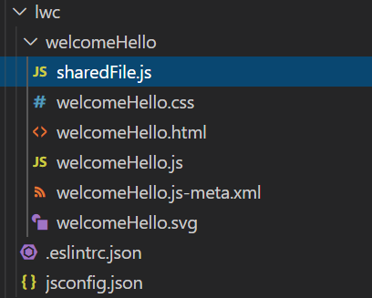

## Tip 1 - Casing
| Case Type | Description | Where to use |
| ----------- | ----------- | ----------- |
| Pascal Case | JourneyToLwc | Its used to create a class name (ItemName) |
| Camel Case| journeyToLwc | Component and Property names in Javascript are in camel Case (itemName) |
| Kebab Case | journey-to-lwc | HTML attributes are in kebab case and Its used to LWC for component rendering, calling from one component to another component, set value attribute name to other component in LWC (item-name) |

## Tip 2 - Component Bundle
1. Html file - Holds the markup of your component. Contains HTML tags.
2. Javascript file - Defines business logic and event handling like onclicking of button load data from salesforce, show something..etc.
3. Metadata Config file - Design configuration properties, allowing LWC to be avilable in lightning app builder
4. CSS file - additional styling for LWC component (optinal file)
5. SVG file - Scalable Vector graphics image files (optional file)

## Tip 3 - Decorators
> **@api**
> - Marks a field/property as public.
> - HTML markup can access the component’s public properties.
> - All public properties are reactive. Reactive means the framework observe the property for change. When property changes value then the framework reacts and renders the component.  

> **@track**
> - Observe changes to the properties of an object or to the elements of an array.
> - renders the component when changes occurs.  

> **@wire**
> - Reactive wire services utilized to read salesforce data from apex.