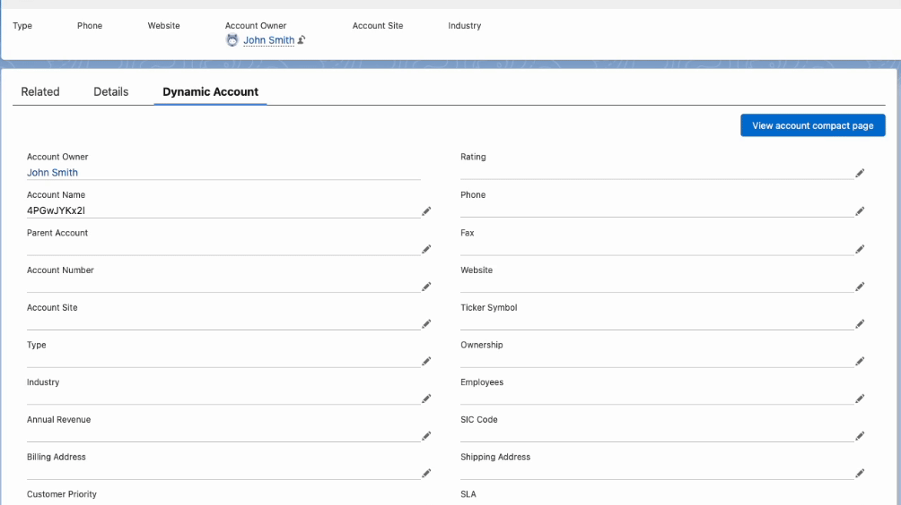

# Salesforce Lightning Web Components
## Day 1 - Introduction
Create an app page and include the following components
1. Bind an HTML element to a component property. (display a message using javascript variable) - **HELLO WORLD**
2. Change the value of a bound property when the value of an input field changes. (display a message say `Hello <your name>`. Here name must be dynamically changed from an input field" - **BINDING**
3. Use JavaScript expressions in a template. (take two input fields say first name and last name and display them in uppercased) - EXPRESSIONS
4. Conditionally render elements. (take a checkbox if true show something, if false hide it) - **CONDITIONAL RENDERING**
5. Loop through an array of items in a template. (use an array of objects. say name and title in each object.) - **FOREACH**
6. Loop through an array with special behavior for the first and last items. (same as task 5 use **ITERATOR** instead of **FOREACH**. add a line at the top and end of the elements i.e, first and last items) -** ITERATOR**

## Day 2: Communication / Composition
1. Nest a child component into a parent component and pass data to the child component using its public (@api) properties. => Take an input from parent and display the value by changing its case in child component.
2. Nest a child component into a parent component and pass data to the parent component using HTML markup and eventlister. => Take an input from child component and display values in parent component.
3. Loop through an array of items in a template, and nest an instance of a child component for each item in the array. => create a child component which displays user info card. Iterate child in parent using array of user info from parent.
4. Create an experience component by assembling multiple child components. Type a few characters in the search bar to experience the recipe. => take input from parent and serach contacts from a defined set of contact data. If contacts found display them using child component created in Task 3
5. Load a component dynamically by assigning a constructor at runtime. => on click of a button display Hello world component (Day 1 - Task 1). Ref: [Dynamically Instantiate Components](https://developer.salesforce.com/docs/platform/lwc/guide/js-dynamic-components.html)

## Day 3 - Dynamic Component
Create a dynamic component that will show two different layouts, say Compact and full.
1. Choose object and fields/layout of your choice. Make sure two layouts are different.
2. Create two components for two layouts.  
3. Add a button to the lightning page. on click of it the page should toggle between the two components. 
 
Attached a sample GIF for reference.  
  
**Hint**: Complete Day 2 Task 5.  
**Ref**: [Dynamically Instantiate Components](https://developer.salesforce.com/docs/platform/lwc/guide/js-dynamic-components.html) 

## Day 4 - Template Switching
1. Create three HTML templates one for each Account, Contact and Lead.
2. Display default page layouts using lightning record forms. Hardcode record Id's for each object for now. (in future tasks we make it dynamic)
3. Add a dropdown in each template which has the options 'Account', 'Contact', 'Lead'.
4. Add a button in each template with the dynamic label 'Switch to \<object from dropdown> Template'. eg: Switch to Lead Template, Switch to Account Template, Switch to Contact Template.
5. On click of the button the template should change accordingly.

**Ref**: [Render Multiple Templates](https://developer.salesforce.com/docs/platform/lwc/guide/create-render.html)

## Read All About It

- [Lightning Design System](https://www.lightningdesignsystem.com/)
- [LWC Documentation](https://developer.salesforce.com/docs/platform/lwc/guide/get-started-introduction.html)
- [Lightning Component Library](https://developer.salesforce.com/docs/component-library/overview/components)
- [Salesforce DX Developer Guide](https://developer.salesforce.com/docs/atlas.en-us.sfdx_dev.meta/sfdx_dev/sfdx_dev_intro.htm)
- [Salesforce Extensions Documentation](https://developer.salesforce.com/tools/vscode/)
